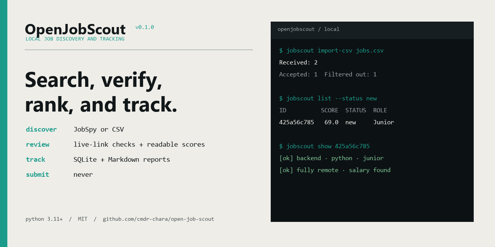
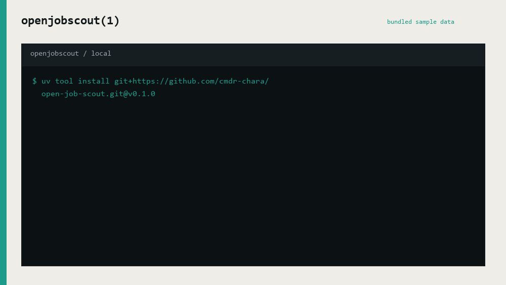

# OpenJobScout

**Find, verify, rank, and track jobs locally.**

[](https://github.com/cmdr-chara/open-job-scout/actions/workflows/ci.yml)
[](https://www.python.org/)
[](LICENSE)



> 🇮🇹 **Preferisci l'italiano?**
> Leggi la **[guida completa in italiano](docs/getting-started.it.md)**.

OpenJobScout searches job boards, filters and ranks listings with rules you can
inspect, checks whether links are still live, and keeps your applications in a
local SQLite database. There is no OpenJobScout account and no hosted server
receiving your CV, notes, or search history.

> Alpha software: always confirm a listing on the employer's official careers
> page before applying.

## Why OpenJobScout?

- Local SQLite database; no account required.
- Transparent keyword scoring, never presented as an "ATS score".
- Search through JobSpy or import an existing CSV; each source fails independently.
- Optional Firecrawl discovery for public employer careers sites, disabled by default
  and enabled only with `FIRECRAWL_API_KEY`.
- Conservative `remote`, `hybrid`, `onsite`, or `unknown` classification.
- Link and public ATS verification, with employer-published compensation when
  an ATS exposes it as structured data.
- Expired results are retained as `closed`; a unique same-title Ashby successor
  is shown as a suggestion and never substituted automatically.
- Unreviewed records not seen for the configured interval become `stale`.
- Application states: `new`, `reviewed`, `applied`, `interview`, `rejected`,
  `offer`, `closed`, and `stale`. Manual states survive crawler refreshes.
- Durable per-job history records discovery, verification changes, automatic
  transitions, manual status changes, and notes.
- Re-verify existing jobs without re-running discovery or changing
  `last_seen_at` with `recheck`.
- Filter the accumulated queue by status, work mode, source, score, or text and
  sort it by score or recency.
- Human-readable job details by default, with JSON retained for scripting.
- Focused `next` and guided `review` workflows for working the queue without
  repeatedly copying IDs between commands.
- Open canonical or source URLs directly from the CLI and add notes without
  changing application state.
- Markdown reports plus portable CSV and JSON exports for local analysis.
- `stats` summarizes the pipeline, source mix, work modes, salary coverage, and
  highest-ranked new jobs.
- `doctor` checks local configuration, SQLite integrity/schema, filesystem
  permissions, writable report storage, source safety, and discovery dependencies.
- No automatic applications.

## Demo

The animation uses the two fictional listings included in
[`tests/fixtures/jobs.csv`](tests/fixtures/jobs.csv). No live job board is
contacted for this demonstration.



## Quick start

Requirements:

- Python 3.11 or 3.12
- [uv](https://docs.astral.sh/uv/)

Install the command directly from GitHub:

```powershell
uv tool install git+https://github.com/cmdr-chara/open-job-scout.git@v0.1.0
jobscout init
```

The repository also ships a native Rust binary with the same SQLite tracker
schema. To build or install that runtime locally:

```powershell
cargo build --locked --release
cargo install --path . --locked
```

The Python `uv` command remains supported for compatibility; the Rust binary
is the native release target and is distributed separately in the tagged
cross-platform release artifacts.

The commands work in PowerShell, macOS, and Linux shells. OpenJobScout stores
its configuration and data under `~/.openjobscout/` by default. On Unix-like
systems newly initialized config and database files are restricted to the
current user.

The `init` command creates:

```text
~/.openjobscout/config.toml
```

Edit that file before the first search. For example:

```toml
[search]
terms = [
  "junior backend developer",
  "graduate software engineer",
]
sites = ["linkedin", "google"]
location = "Italy"
country_indeed = "Italy"
results_per_term = 20
max_age_days = 14
```

Run the first search:

```powershell
jobscout search
```

### Optional: search employer career sites with Firecrawl

The normal workflow does not need Firecrawl. To add it as a complementary source,
export the API key and enable the existing config section:

```powershell
$env:FIRECRAWL_API_KEY = "fc-..."
```

```toml
[firecrawl]
enabled = true
search_enabled = true
search_limit_per_term = 8
max_scrapes = 16
career_urls = []
interact_urls = []
include_domains = []
timeout_seconds = 45
zero_data_retention = true
```

OpenJobScout keeps JobSpy and the native Greenhouse, Lever, Ashby, and Recruitee API
paths; Firecrawl results are normalized and enter the same local ranking, verification,
SQLite, and report pipeline. Browser interaction is exact-URL opt-in and is not used for
login, CAPTCHA bypass, personal-data entry, or application submission. See
[Optional Firecrawl discovery](docs/firecrawl.md) for domain filters, known career URLs,
privacy boundaries, API usage, and failure behavior.

## The everyday review loop

The normal workflow no longer requires bouncing between a table and raw JSON.
Ask OpenJobScout for the highest-priority new job:

```powershell
jobscout next
```

`next` prints a readable summary with score, status, work mode, verification,
salary, reasons, concerns, notes, links, a description preview, and useful
follow-up commands.

Open the employer/canonical page:

```powershell
jobscout open JOB_ID
```

Open the original job-board result instead when needed:

```powershell
jobscout open JOB_ID --source
```

Record a thought without changing the application state:

```powershell
jobscout note JOB_ID "Check the on-call requirement before applying"
```

Then update the workflow state when you actually make a decision:

```powershell
jobscout mark JOB_ID reviewed
jobscout mark JOB_ID applied --note "Applied on the employer careers page"
jobscout mark JOB_ID interview --note "Technical interview on Friday"
```

Continue immediately with:

```powershell
jobscout next
```

You can combine selection and browser opening:

```powershell
jobscout next --work-mode remote --min-score 70 --open
```

For a batch of jobs, use the guided review session instead:

```powershell
jobscout review
jobscout review --work-mode remote --min-score 60 --limit 10
```

For each job, `review` accepts simple actions:

```text
o  open the job in your browser
n  add a note without changing status
r  mark reviewed and move on
a  mark applied and move on
x  mark rejected and move on
c  mark closed and move on
s  skip without changing anything
q  quit the session
?  show the action help
```

The session never changes a job merely because it was displayed. Status changes
happen only after an explicit status action.

## Inspect a job

`show` is intended for humans by default:

```powershell
jobscout show JOB_ID
```

Use the complete description when you want it:

```powershell
jobscout show JOB_ID --full
```

For scripts and local tooling, the old structured representation remains
available explicitly:

```powershell
jobscout show JOB_ID --json
```

Short aliases are also available for frequently typed read commands:

```powershell
jobscout ls
jobscout view JOB_ID
jobscout log JOB_ID
```

## Example

This is the output produced by importing the two listings in the bundled
sample CSV. One matches the configured junior backend search; the senior role
is filtered out.

```text
Received: 2
Unique valid jobs: 2
Accepted: 1
Filtered out: 1
Verification: unverified=1
Stored or refreshed: 1

ID          SCORE  STATUS     MODE     ROLE
425a56c785   69.0  new        remote   Junior Python Backend Engineer - Example Labs
```

Each `search` and `import-csv` command also writes a timestamped Markdown
snapshot automatically. Generate a fresh report from the current local tracker
when you need one:

```powershell
jobscout report
jobscout report --status interview
```

## Work the queue

As the local database grows, filter the same tracker instead of repeating the
search manually:

```powershell
jobscout list --status new --work-mode remote --min-score 60 --query python
jobscout list --source linkedin --sort newest
jobscout report --work-mode remote --min-score 70
```

Get a compact pipeline snapshot:

```powershell
jobscout stats
```

Export the current filtered view for a spreadsheet or another local tool. CSV
is the default; JSON preserves list-valued fields such as reasons and concerns:

```powershell
jobscout export --status applied --format csv
jobscout export --work-mode remote --min-score 70 --format json --output remote-jobs.json
```

Exports are written to the configured report directory unless `--output` is
provided. `export` includes all matching jobs by default; pass `--limit N` when
you only want the first N rows.

## Recheck and audit existing jobs

`search` means the listing was found again by a configured source, so it updates
the discovery timestamp. `recheck` has different semantics: it revisits the
stored public job/ATS URL, refreshes verification metadata and the local score,
and deliberately leaves `last_seen_at` unchanged.

Recheck specific jobs:

```powershell
jobscout recheck 425a56c785 76be194aa1
```

Or recheck a filtered slice of the tracker. The default limit is 50 to avoid an
accidental burst of network requests:

```powershell
jobscout recheck --status new --work-mode remote --min-score 60
jobscout recheck --status closed --limit 20
```

Automatic `closed` jobs can return to `new` if a recheck proves the listing is
active again. A manual application state such as `applied` or `interview` is not
overwritten. A `stale` job also stays stale until discovery sees it again.

The schema-v3 history table records these transitions separately from the
legacy notes field:

```powershell
jobscout history 425a56c785
jobscout history 425a56c785 --json
```

Existing databases migrate automatically. They receive one `snapshot` history
event so the audit trail has a clear starting state; subsequent changes are
recorded as individual events.

## Diagnose the local installation

Run a local health check before troubleshooting discovery or database problems:

```powershell
jobscout doctor
jobscout doctor --json
```

`doctor` validates the configuration, reports disabled/unsafe source choices,
checks the SQLite schema and `PRAGMA quick_check`, warns about permissive Unix
config/database file modes, checks report-directory writability, confirms that JobSpy is
importable in the Python runtime, and reports a missing `FIRECRAWL_API_KEY` when the
optional hosted source is enabled. It does not perform a live job-board search.

JobSpy is installed as the default Python discovery engine. The native Rust search uses
configured first-party ATS providers. The tracker and CSV importer remain usable when a
particular job board is unavailable. The Indeed adapter is temporarily disabled because
its current upstream implementation does not verify TLS certificates; see
[SECURITY.md](SECURITY.md).

For every option, see the annotated
[full configuration template](examples/config.example.toml).

For the complete walkthrough, configuration reference, data locations, and
troubleshooting, read:

- [Getting started](docs/getting-started.md)
- [Guida introduttiva in italiano](docs/getting-started.it.md)
- [Optional Firecrawl discovery](docs/firecrawl.md)

## Install for development

```powershell
git clone https://github.com/cmdr-chara/open-job-scout.git
cd open-job-scout
uv sync --extra dev
uv run jobscout init
uv run jobscout search
```

## Commands

```text
jobscout --version
jobscout init [--output PATH] [--force]
jobscout search [--config PATH] [--no-verify]
jobscout import-csv FILE [--config PATH] [--no-verify]
jobscout list [--config PATH] [--status STATUS] [--work-mode MODE] [--source SOURCE]
              [--min-score N] [--query TEXT] [--sort score|newest] [--limit N]
jobscout next [--config PATH] [--work-mode MODE] [--source SOURCE] [--min-score N]
              [--query TEXT] [--sort score|newest] [--open] [--full]
jobscout review [--config PATH] [--work-mode MODE] [--source SOURCE] [--min-score N]
                [--query TEXT] [--sort score|newest] [--limit N]
jobscout show ID [--config PATH] [--full] [--json]
jobscout open ID [--config PATH] [--source]
jobscout note ID TEXT [--config PATH]
jobscout mark ID STATUS [--config PATH] [--note TEXT]
jobscout history ID [--config PATH] [--limit N] [--json]
jobscout recheck [ID ...] [--config PATH] [--status STATUS] [--work-mode MODE]
                 [--source SOURCE] [--min-score N] [--query TEXT]
                 [--sort score|newest] [--limit N] [--workers N]
jobscout report [--config PATH] [--status STATUS] [--work-mode MODE] [--source SOURCE]
                [--min-score N] [--query TEXT] [--sort score|newest] [--limit N]
                [--output PATH]
jobscout stats [--config PATH]
jobscout export [--config PATH] [--status STATUS] [--work-mode MODE] [--source SOURCE]
                [--min-score N] [--query TEXT] [--sort score|newest] [--limit N]
                [--format csv|json] [--output PATH]
jobscout doctor [--config PATH] [--json]
```

By default, personal state is written beneath `~/.openjobscout/`. The repository
does not need to contain a CV, database, generated report, or private config.

## Privacy and network use

Your configuration, SQLite database, reports, notes, event history, and any
imported CSV stay on your machine. Put imported files in `data/` if you keep
them beside the repository: that directory is ignored by Git. OpenJobScout does
not submit a CV or an application.

Discovery and verification do make network requests to the job boards you
configure and to public job or ATS URLs in the results. When Firecrawl is explicitly
enabled, the configured search terms/location and selected public career/job URLs are
also sent to Firecrawl; the local tracker, CV, application history, and notes are not.
`recheck` performs only the existing verification requests. `open` launches the chosen
URL in your local default browser. Review the relevant services' terms and privacy
notices before using them.

## Scoring

The score is a configurable prioritization heuristic based on title terms,
skills, junior signals, concerns, and work-location evidence. It is intended to
help order a review queue. It does not predict whether an employer's ATS or
recruiter will accept an application.

## Responsible use

Job boards may rate-limit or prohibit some forms of automated access. Use modest
query volumes, avoid repeated runs, review the terms of each source, and prefer
public ATS APIs or official careers pages. OpenJobScout does not bypass
authentication, CAPTCHAs, or access controls.

## Development

```powershell
uv run pytest
uv run ruff check .
```

See [CHANGELOG.md](CHANGELOG.md), [CONTRIBUTING.md](CONTRIBUTING.md), and
[SECURITY.md](SECURITY.md).
Third-party attribution is recorded in
[THIRD_PARTY_NOTICES.md](THIRD_PARTY_NOTICES.md).