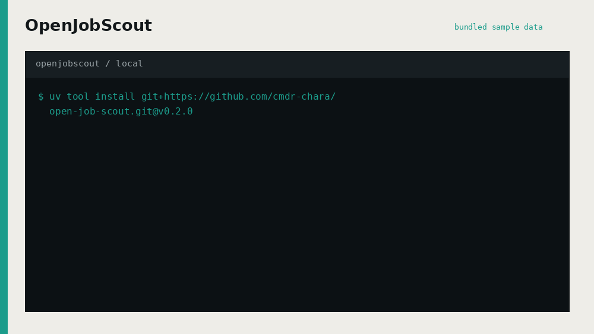

# OpenJobScout

**A local-first job search tracker that helps you find, verify, rank, and follow up on roles without losing the context around each application.**

[](https://github.com/cmdr-chara/open-job-scout/actions/workflows/ci.yml)
[](https://www.python.org/)
[](LICENSE)

OpenJobScout keeps a searchable SQLite tracker on your computer. It combines job discovery, transparent ranking, public-page verification, application status, notes, durable history, and dated follow-up actions. It does **not** submit applications, bypass CAPTCHAs, or require an OpenJobScout account.

> **Alpha software:** verify the employer, role, location, compensation, and application page yourself before applying.



Prefer Italian? Read the [Italian getting-started guide](docs/getting-started.it.md).

## What it is good at

- Keeping every role, status change, note, and follow-up in one local tracker.
- Ranking jobs with inspectable title, skill, experience, salary, concern, and freshness signals.
- Capturing a public job page you found manually, without retyping the whole posting.
- Rechecking existing URLs without pretending that a verification is a new discovery.
- Preserving manual states such as `applied`, `interview`, `rejected`, and `offer` during refreshes.
- Showing what needs attention today with `due`, `stats`, and `insights`.
- Exporting filtered records as CSV, JSON, or Markdown for your own local workflow.

## Choose your runtime

OpenJobScout has two runtimes that share the SQLite tracker schema and core status semantics.

| | Python compatibility runtime | Native Rust runtime |
| --- | --- | --- |
| Best for | Full discovery and the easiest setup | Fast local TUI, first-party ATS search, and portable binaries |
| Install | `uv tool install git+https://github.com/cmdr-chara/open-job-scout.git` | Download a binary from [Releases](https://github.com/cmdr-chara/open-job-scout/releases/latest) or build with Cargo |
| Discovery | JobSpy sources, CSV import, public URL capture, optional Firecrawl | Greenhouse, Lever, Ashby, Recruitee, and optional Firecrawl |
| Review | `list`, `next`, `review`, browser open, notes, reports, exports | TUI plus scriptable tracker commands |
| Shared data | Local SQLite, schema v4 | Local SQLite, schema v4 |
| Use this when | You want the broadest source support and guided workflow | You already have provider board IDs or want the native release binary |

The runtimes can use the same database. Do not run two writers against the same database at the same time while performing migrations or bulk imports.

## Install

### Python runtime

Requirements: Python 3.11 or 3.12 and [uv](https://docs.astral.sh/uv/).

```bash
uv tool install git+https://github.com/cmdr-chara/open-job-scout.git@v0.2.0
jobscout --help
jobscout init
```

To install a specific tagged release, append `@TAG` to the Git URL, for example `@vX.Y.Z`.

For development, clone the repository and use the project environment:

```bash
git clone https://github.com/cmdr-chara/open-job-scout.git
cd open-job-scout
uv sync --extra dev
uv run jobscout --help
```

### Native Rust release

Download the archive for your platform from the [latest release](https://github.com/cmdr-chara/open-job-scout/releases/latest), unpack it, and put `jobscout` (or `jobscout.exe`) on your `PATH`.

The current `v0.2.0` release publishes these native archives:

- `openjobscout-linux-x86_64.tar.gz`
- `openjobscout-windows-x64.zip`
- `openjobscout-darwin-arm64.tar.gz`

Choose the archive that matches your operating system and CPU architecture. Future
releases may add more architecture variants; the exact asset names are listed on
the release page.

Each release provides the native `jobscout` binary archive together with a matching SHA-256 checksum file. If you prefer to build locally:

```bash
cargo test --locked --all-targets --all-features
cargo build --locked --release
```

The Rust binary does not provide the Python `init`, `capture`, `next`, `review`, or `insights` commands. It reads the same TOML shape and SQLite tracker, but its discovery path is configured first-party ATS boards and its review path is the native TUI plus the Rust command set below.

## Five-minute Python setup

### 1. Create a config

```bash
jobscout init
```

This creates a config and database under `~/.openjobscout/` by default. On Windows, the equivalent directory is `%USERPROFILE%\\.openjobscout\\`.

### 2. Edit the config before searching

Open `~/.openjobscout/config.toml` and set your actual search terms, location, sources, filters, and ranking preferences. Start small:

```toml
[search]
terms = ["junior backend developer", "python software engineer"]
sites = ["linkedin", "google"]
location = "Italy"
country_indeed = "Italy"
results_per_term = 20
max_age_days = 14

[filters]
require_remote = false
blocked_title_terms = ["senior", "staff", "principal", "director"]
max_required_years = 3

[ranking]
preferred_title_terms = ["backend", "python", "software engineer"]
preferred_skills = ["python", "fastapi", "postgresql", "docker"]
freshness_window_days = 30
freshness_bonus = 10
```

The complete annotated template is [examples/config.example.toml](examples/config.example.toml). The score is a review-queue heuristic, not an ATS score and not a prediction of an employer's decision.

### 3. Search

```bash
jobscout search
```

To import a local JobSpy-compatible file instead:

```bash
jobscout import-csv jobs.csv
```

Both commands filter, deduplicate, optionally verify public URLs, rank retained roles, write them to SQLite, and create a timestamped Markdown report. Add `--no-verify` when you deliberately want to skip outgoing verification requests.

### 4. Start with the highest-ranked role

```bash
jobscout next
jobscout show JOB_ID
jobscout open JOB_ID
```

`show` prints a readable summary by default. Add `--full` for the complete description or `--json` for scripting.

## Daily workflow

### Capture a role you found yourself

The Python runtime can save one public job page directly:

```bash
jobscout capture https://careers.example.com/jobs/backend-engineer
jobscout capture https://careers.example.com/jobs/backend-engineer \
  --company "Example Labs" --location "Milan" --json
```

Capture reads public page metadata and `JobPosting` JSON-LD when available. Use `--title`, `--company`, or `--location` to fill a field that the page does not expose. It never submits a form or enters an application flow.

### Review without losing your place

```bash
jobscout list --status new --work-mode remote --min-score 60
jobscout review --work-mode remote --min-score 60 --limit 10
```

The guided `review` session supports opening a job, adding a note, marking a status, skipping, and quitting. Displaying a job does not change its status.

Useful individual actions:

```bash
jobscout note JOB_ID "Check the on-call requirement before applying"
jobscout mark JOB_ID reviewed
jobscout mark JOB_ID applied --note "Applied on the employer careers page"
jobscout mark JOB_ID interview --note "Technical interview on Friday"
jobscout history JOB_ID
```

### Keep one next action per application

```bash
jobscout follow-up JOB_ID 2026-10-14 \
  --note "Ask recruiter about the salary band"
jobscout due
jobscout due --days 7
jobscout due --days 7 --json
jobscout follow-up JOB_ID --clear
```

Follow-up dates and notes survive discovery refreshes and appear in job details, JSON/CSV/Markdown exports, `stats`, and `insights`.

### Make a decision from the queue

```bash
jobscout stats
jobscout insights
jobscout list --status applied --sort newest
jobscout export --status applied --format csv --output applied.csv
```

Use `--json` on `list`, `next`, `show`, `due`, `history`, `stats`, and `insights` when another local tool needs structured output.

## Core Python commands

| Command | Purpose |
| --- | --- |
| `init` | Create the local TOML config |
| `search` | Discover, filter, verify, rank, and store jobs |
| `import-csv FILE` | Import a JobSpy-compatible CSV |
| `capture URL` | Save one public job page |
| `list` / `ls` | Filter the local queue |
| `next` | Show the highest-priority `new` job |
| `review` | Work through a guided batch |
| `show ID` / `view ID` | Inspect a tracked job |
| `open ID` | Open the preferred public URL safely |
| `note ID TEXT` | Append a note without changing status |
| `mark ID STATUS` | Set the application state |
| `follow-up ID DATE` | Schedule a next action |
| `due` | List overdue and upcoming actions |
| `history ID` / `log ID` | Inspect durable events |
| `recheck` | Re-verify existing jobs without rediscovery |
| `report` | Write a Markdown report |
| `stats` | Print tracker counts and funnel metrics |
| `insights` | Explain pipeline health and recommended actions |
| `export` | Write filtered CSV or JSON |
| `doctor` | Check config, database, permissions, and dependencies |

Run `jobscout COMMAND --help` for every option. Most read and export commands accept status, work-mode, source, score, query, sort, limit, and `--json` filters where applicable.

## Native Rust commands

The native binary accepts global `--config PATH` and `--database PATH` overrides:

```bash
jobscout --config ~/.openjobscout/config.toml list --json
jobscout --database ./jobs.sqlite3 stats --json
```

Available Rust commands are:

```text
jobscout                 # open the TUI
jobscout ui              # open the TUI explicitly
jobscout search          # search configured ATS providers / Firecrawl
jobscout list
jobscout show ID
jobscout mark ID STATUS [--note TEXT]
jobscout note ID TEXT
jobscout follow-up ID [DATE] [--note TEXT] [--clear]
jobscout due [--days N] [--limit N] [--json]
jobscout history ID [--limit N] [--json]
jobscout import-csv FILE [--no-verify] [--workers N]
jobscout report [--output PATH] [--limit N]
jobscout rerank
jobscout recheck [--workers N]
jobscout stats [--json]
jobscout export [OUTPUT] [--output PATH] [--format json|csv]
jobscout doctor [--json]
jobscout stale [--days N]
```

Rust `search` needs at least one configured `[providers]` board identifier or an explicitly enabled `[firecrawl]` section. For example:

```toml
[providers]
greenhouse = ["company-board-slug"]
lever = ["company-site-slug"]
ashby = ["company-board-slug"]
recruitee = ["company-slug"]
```

The native TUI supports keyboard navigation, live search, opening a tracked URL, adding notes, viewing history, changing status, and reloading the tracker. See [docs/rust-v2.md](docs/rust-v2.md) for the current native-runtime details.

## Optional Firecrawl discovery

The normal Python workflow does not need Firecrawl. It is an explicit, optional source for public employer career pages and difficult JavaScript-rendered pages.

```bash
export FIRECRAWL_API_KEY="fc-..."
```

Then enable the `[firecrawl]` section in your config. Keep `zero_data_retention = true`, use domain allow-lists where possible, and review [docs/firecrawl.md](docs/firecrawl.md) before enabling it. The API key is read from the environment and is not written to the TOML file.

Firecrawl discovery, like every other source, feeds the same local filtering, verification, ranking, and tracker pipeline. It does not submit applications or handle login and CAPTCHA flows.

## Recheck, stale jobs, and history

`search` means a source found the job again and may update its discovery timestamp. `recheck` revisits already stored public URLs and ATS data without claiming a new discovery:

```bash
jobscout recheck JOB_ID
jobscout recheck --status new --work-mode remote --min-score 60
```

Jobs that have not been seen for the configured interval can be marked `stale` automatically during discovery. The native runtime also exposes `stale --days N` directly. A manual application state remains authoritative during refreshes.

SQLite schema upgrades run automatically. Schema v4 stores next-action fields and an append-only event history for discovery, verification, status changes, notes, and follow-ups. Back up a database before deliberately testing a migration or running multiple versions against it.

## Privacy and safety

- Config, SQLite data, notes, event history, reports, and imported CSV files stay on your machine.
- Discovery and verification still make network requests to the sources and public URLs you configure.
- Firecrawl receives only the search terms/location and public career URLs needed for the enabled operation; your local CV, notes, and application history are not uploaded by OpenJobScout.
- Public URL checks reject malformed, credential-bearing, local, private, and other unsafe network targets; browser opening also validates DNS results immediately before launch.
- The browser command opens a public URL; it does not enter credentials or application data.
- CSV exports neutralize spreadsheet formula injection.
- Never commit CVs, databases, reports, application answers, email exports, or real imported data. The repository's `data/` directory is intended for local files and is ignored by Git.

See [SECURITY.md](SECURITY.md) for security reporting and source-specific limitations.

## Troubleshooting

### `jobscout` is not recognized

Restart the terminal after a `uv tool install`, or run from a checkout:

```bash
uv run jobscout --help
```

### `search` finds nothing

Run `jobscout doctor`, check the spelling of `terms` and `location`, start with one or two sources, and lower `results_per_term`. A source can fail or rate-limit independently. You can still use `capture`, `import-csv`, and the local tracker.

### Native Rust search says no source is configured

Add one or more board identifiers under `[providers]`, or explicitly enable Firecrawl and provide its key. The Rust runtime does not use the Python JobSpy `sites` list as a provider registry.

### A stored job is closed or stale

Open the employer page yourself. Search indexes and job boards can retain expired listings. `recheck JOB_ID` can verify whether a closed listing becomes active again without changing its discovery timestamp.

### Where are my files?

By default:

| File | Location |
| --- | --- |
| Config | `~/.openjobscout/config.toml` |
| Database | `~/.openjobscout/jobs.sqlite3` |
| Reports | `~/.openjobscout/reports/` |

On Windows, use `%USERPROFILE%\\.openjobscout\\` instead of `~/.openjobscout/`.

## Documentation and development

- [Getting started](docs/getting-started.md)
- [Italian getting started](docs/getting-started.it.md)
- [Configuration template](examples/config.example.toml)
- [Providers and source behavior](docs/providers.md)
- [Optional Firecrawl discovery](docs/firecrawl.md)
- [Background operations](docs/background-operations.md)
- [Native Rust runtime](docs/rust-v2.md)
- [Contributing](CONTRIBUTING.md)
- [Security policy](SECURITY.md)

Run the checks before opening a pull request:

```bash
uv sync --extra dev
uv run python scripts/check_runtime_contract.py
uv run ruff check .
uv run pytest -q
uv build
cargo fmt --all --check
cargo clippy --locked --all-targets --all-features -- -D warnings
cargo test --locked --all-targets --all-features
```

Python and Rust changes that touch the shared schema or tracker behavior must preserve cross-runtime compatibility. Use fictional jobs and temporary databases in tests.

## License

OpenJobScout is released under the [MIT License](LICENSE).
